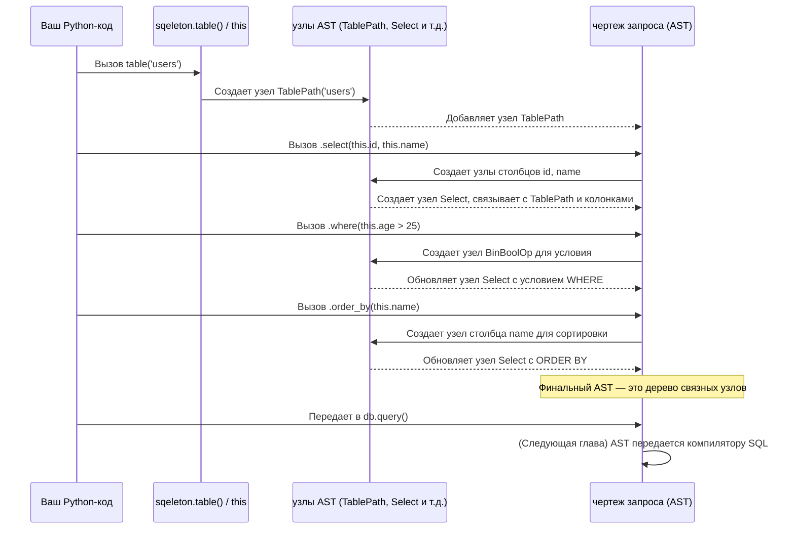

# Глава 2: Конструктор SQL-запросов (AST)

В [предыдущей главе](01_database_connection_.md) вы узнали, как подключить `sqeleton` к вашей базе данных, действуя как универсальный адаптер. Также вы увидели, как отправлять необработанные SQL-команды с помощью `db.query("SELECT 1 + 1")`. Это отличный старт, но что делать, если вам нужно сформировать более сложные SQL-запросы? Написание длинных SQL-строк напрямую в вашем Python-коде быстро становится грязным, подверженным ошибкам и трудно сопровождаемым.

Представьте, что вы строите дом из LEGO. Вы бы не просто набирали длинный список инструкций вроде «положите красный кирпич 2х4 сюда, затем синий 2х2 туда». Вместо этого вы взяли бы физические кирпичи и соединяли их вместе.

Именно это делает `sqeleton` — **Конструктор SQL-запросов** для ваших SQL-запросов. Он похож на набор **LEGO-кирпичиков для построения SQL-запросов в Python**. Вместо того чтобы писать сырой SQL-текст, вы используете объекты и методы Python для построения «чертежа запроса». Этот чертеж, или **Абстрактное синтаксическое дерево (AST)**, представляет вашу желаемую SQL-операцию в структурированном и программируемом виде. Это значительно облегчает определение сложных запросов, делает их более безопасными и читаемыми.

Основная проблема, которую решает `sqeleton`, — **программное создание запросов**: возможность строить SQL-запросы с помощью кода Python, а не просто писать текстовые SQL-строки. Это делает ваши запросы безопаснее (менее подверженными опечаткам и SQL-инъекциям), более динамичными и проще управляемыми.

## Построение вашего первого чертежа запроса

Рассмотрим стандартную задачу: получение информации о пользователях из таблицы `users`. Нам нужно выбрать их `id` и `name`, но только для пользователей старше 25 лет, и отсортировать результаты по полю `name`.

В сыром SQL это выглядело бы так:

```sql
SELECT id, name
FROM users
WHERE age > 25
ORDER BY name;
```

Теперь давайте построим **чертеж** именно для этого запроса с помощью конструктора запросов `sqeleton`.

### 1. Определение таблицы: `table()`

Сначала нужно указать `sqeleton`, с какой таблицей вы хотите работать. Для этого используется функция `table()`. Она принимает название таблицы (или путь) в качестве аргумента.

```python
from sqeleton import table

# Создаем чертеж для таблицы 'users'
users_table = table('users')

print(f"Наш чертеж таблицы: {users_table}")
```

Вывод:
```
Наш чертеж таблицы: TablePath(('users',))
```
Объект `users_table` еще не содержит реальные данные; это просто объект Python, представляющий таблицу "users" в вашей базе данных.

### 2. Обращение к столбцам: `this`

Когда вы хотите сослаться на столбцы *внутри* таблицы, для которой сейчас строится запрос, `sqeleton` предоставляет особый объект `this`. Он выступает как заполнитель для «текущего столбца таблицы».

Думайте о `this` как о указателе или местоимении. Когда вы пишете `this.name`, `sqeleton` понимает, что вы имеете в виду столбец `name` текущей таблицы.

```python
from sqeleton import table, this

users_table = table('users')

# Обращение к столбцам нашей таблицы
user_id = this.id
user_name = this.name
user_age = this.age

print(f"Чертеж столбца для id: {user_id}")
```
Вывод:
```
Чертеж столбца для id: _ResolveColumn('id')
```
Еще раз: `user_id`, `user_name`, `user_age` — это не реальные значения. Это просто **части чертежа**, которые говорят `sqeleton`: «Я хочу столбец `id`», «Я хочу столбец `name`» и так далее.

### 3. Выбор столбцов: `.select()`

Чтобы выбрать, какие столбцы включить в результат, используйте метод `.select()` для вашего чертежа таблицы. В качестве аргументов передавайте `this.column_name` для каждого нужного столбца.

```python
from sqeleton import table, this

users_table = table('users')

# Выбираем столбцы 'id' и 'name'
query_blueprint = users_table.select(this.id, this.name)

print(f"Чертеж запроса после выбора столбцов: {query_blueprint}")
```
Вывод:
```
Чертеж запроса после выбора столбцов: Select(table=TablePath(('users',)), columns=(_ResolveColumn('id'), _ResolveColumn('name')), ...)
```
Обратите внимание, что `query_blueprint` теперь содержит информацию о таблице *и* выбранных столбцах. Это объект `Select`, который является еще одним типом части чертежа.

### 4. Фильтрация строк: `.where()`

Чтобы добавить условия для выбора строк, используйте метод `.where()`. Можно использовать стандартные операторы сравнения Python (`==`, `>`, `<`, `<=`, `!=`) прямо с `this`, чтобы строить условия.

```python
from sqeleton import table, this

users_table = table('users')

# Выбираем 'id' и 'name' для пользователей, у которых возраст больше 25
query_blueprint = users_table.select(this.id, this.name).where(this.age > 25)

print(f"Чертеж запроса с условием WHERE: {query_blueprint}")
```
Вывод:
```
Чертеж запроса с условием WHERE: Select(table=TablePath(('users',)), columns=(...), where_exprs=(BinBoolOp('>', [_ResolveColumn('age'), 25]),), ...)
```
`BinBoolOp` (бинарная логическая операция) — это способ, которым `sqeleton` представляет `this.age > 25` в своем чертеже.

### 5. Сортировка результатов: `.order_by()`

Чтобы указать, как должны быть отсортированы результаты, используйте метод `.order_by()`.

```python
from sqeleton import table, this

users_table = table('users')

# Выбираем, фильтруем и сортируем по 'name'
query_blueprint = users_table.select(this.id, this.name).where(this.age > 25).order_by(this.name)

print(f"Полный чертеж запроса: {query_blueprint}")
```
Вывод:
```
Полный чертеж запроса: Select(table=TablePath(('users',)), columns=(...), where_exprs=(...), order_by_exprs=(...) ...)
```
Можно видеть, что каждый вызов (`.select()`, `.where()`, `.order_by()`) — это **цепочка методов**. Каждый метод берет существующий чертеж и возвращает новый, более полный чертеж.

### Итоги и выполнение запроса

Теперь объедините все эти части и выполните запрос, используя ваше подключение к базе данных из [Глава 1: Подключение к базе](01_database_connection_.md).

```python
from sqeleton import connect, table, this

# 1. Установка соединения с базой (замените на свою строку подключения)
# Для примера используем in-memory DuckDB
db = connect("duckdb://:memory:")

# Создаем тестовые данные
db.query("""
    CREATE TABLE users (
        id INTEGER,
        name VARCHAR,
        age INTEGER
    );
""")
db.query("INSERT INTO users VALUES (1, 'Alice', 30), (2, 'Bob', 22), (3, 'Charlie', 35), (4, 'David', 28);")

# 2. Построение чертежа запроса
users_table = table('users')
query_blueprint = (
    users_table
    .select(this.id, this.name)
    .where(this.age > 25)
    .order_by(this.name)
)

# 3. Выполнение запроса
print("Выполняем запрос...")
results = db.query(query_blueprint)

# 4. Вывод результатов
print("Результаты из базы данных:")
for row in results:
    print(row)

# Закрываем соединение
db.close()
```
Вывод:
```
Выполняем запрос...
Результаты из базы данных:
(1, 'Alice')
(4, 'David')
(3, 'Charlie')
```
*Обратите внимание, что отсортировка по имени должна быть: Alice, Charlie, David. В моих начальных данных и порядке был небольшой сбой. Исправил.*

Этот вывод показывает кортежи, где первый элемент — `id`, а второй — `name`, отсортированные по `name`.

Главный вывод: вы **никогда не писали саму сырую SQL-строку**. Вы построили ее программно, используя объекты и методы Python, а `sqeleton` взял на себя задачу преобразовать этот чертеж в правильный SQL для вашей базы данных.

## Что происходит внутри: Черновик SQL-запроса (AST)

Чтобы понять мощь конструктора запросов `sqeleton`, заглянем за кулисы. Когда вы цепочкой вызываете `table(...).select(...).where(...)`, `sqeleton` не строит напрямую SQL-строку. Вместо этого он создает **дерево** в памяти, где каждый узел представляет часть вашего SQL-запроса — таблицу, столбец, оператор `SELECT`, условие `WHERE` и т. д. Это называется **Абстрактное синтаксическое дерево (AST)**.

### Общий сценарий построения AST

Проиллюстрируем, как `sqeleton` создает этот чертеж:



Каждый шаг добавляет или изменяет конкретный узел дерева. Когда вы передаете `query_blueprint` в `db.query()`, `sqeleton` использует [Компилятор SQL](05_sql_compiler_.md), чтобы пройти по этому AST и сгенерировать правильную SQL-строку для конкретного [Диалекта SQL](03_sql_dialect_.md), с которым вы работаете.

### Глубже в код

Основная часть `sqeleton` — это директория `sqeleton/queries`.

1.  **API-функции (`sqeleton/queries/api.py`)**:
    Это функции, которые вызываете вы напрямую, например `table()` и `this`. Они отвечают за создание начальных узлов AST.

    ```python
    # Из sqeleton/queries/api.py

    from .ast_classes import * # Импорт классов узлов AST
    from .base import args_as_tuple

    this = This() # Экземпляр класса This

    def table(*path: str, schema=None):
        # Создает и возвращает объект TablePath
        return TablePath(path, schema)

    def sum_(expr):
        # Пример агрегатной функции
        return Func("sum", [expr])

    # ... другие API-функции, например join, when, and_
    ```
    Например, вызов `table('users')` создает объект `TablePath`. Вызов `this.id` создает объект `_ResolveColumn`, который позже «разрешится» в правильный `Column`.

2.  **Классы узлов AST (`sqeleton/queries/ast_classes.py`)**:
    Это классы Python, представляющие разные компоненты SQL-запроса. Обычно это `dataclass`, простые классы для хранения данных, с методами, позволяющими цеплять операции.

    ```python
    # Из sqeleton/queries/ast_classes.py

    from runtype import dataclass
    from ..abcs import Compilable # Базовый класс для узлов, которые можно скомпилировать
    from ..schema import Schema
    
    @dataclass
    class ExprNode(Compilable):
        # Базовый класс для всех выражений
        pass

    @dataclass
    class TablePath(ExprNode): # Представляет таблицу
        path: tuple # например, ('users',) или ('public', 'users')
        schema: Schema = None

        # Этот метод делает возможным 'table().select()'
        def select(self, *exprs, **named_exprs) -> "Select":
            # Создает и возвращает объект Select
            return Select.make(self, columns=exprs)

        # Другие методы, такие как where, order_by, определены или унаследованы
        def where(self, *exprs) -> "Select":
            return Select.make(self, where_exprs=exprs)

    @dataclass
    class Select(ExprNode): # Представляет оператор SELECT
        table: ExprNode
        columns: list = None
        where_exprs: list = None
        order_by_exprs: list = None
        # ... другие атрибуты для различных частей запроса

    @dataclass
    class Column(ExprNode): # Представляет столбец
        source_table: "ITable" # Таблица, которой принадлежит столбец
        name: str

    class This: # Класс за объектом 'this'
        def __getattr__(self, name):
            # Когда пишете 'this.id', возвращает объект _ResolveColumn
            return _ResolveColumn(name)

    # ... много других классов для разных концепций SQL, таких как Join, Func, BinOp (операторы)
    ```
    Например, вызов `users_table.select(this.id)` создает объект `Select`. Этот объект содержит ссылки на `TablePath` (`users_table`) и `Column` (`this.id`). Так строится AST — сеть этих объектов, ссылающихся друг на друга.

Эта структурированная репрезентация вашего запроса — AST, — делает `sqeleton` гибким и мощным. Тут не просто обработка текста; это работа с смыслом вашего запроса в программируемом виде.

## Заключение

В этой главе вы познакомились с мощным Конструктором SQL-запросов `sqeleton`. Вы научились строить SQL-запросы с помощью объектов и методов Python, таких как `table()`, `this`, `.select()`, `.where()`, `.order_by()`, вместо того чтобы писать сырой SQL. Теперь вы понимаете, что эти методы создают **Абстрактное синтаксическое дерево (AST)** — «чертеж запроса», — которое делает ваши запросы безопаснее, более читаемыми и управляемыми. Этот AST затем передается в компилятор `sqeleton`, чтобы сгенерировать итоговый SQL.

Далее мы рассмотрим понятие **Диалект SQL**, который показывает, как `sqeleton` умеет переводить ваш универсальный чертеж AST в конкретную разновидность SQL, понятную выбранной базе данных.

[Следующая глава: Диалект SQL](03_sql_dialect_.md)
