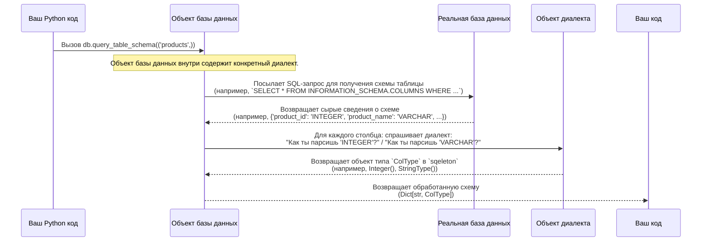

# Глава 4: Типы баз данных и схема

В [предыдущей главе](03_sql_dialect_.md) мы рассмотрели, как [Диалект SQL](03_sql_dialect_.md) `sqeleton` действует как специализированная книга грамматики, переводя ваши универсальные схемы запросов в точный синтаксис SQL, необходимый разным базам данных. Это касается *того, как* пишутся SQL-запросы.

Но базы данных заботятся не только о синтаксисе; их также интересует *значение* и *структура* ваших данных. Представьте, что вы все еще работаете над чертежом дома. У вас есть расположение стен и комнат (это похоже на синтаксис SQL). Но также нужно знать: этот трубопровод для воды или газа? Эта проводка для электричества или интернета? А как устроена эта комната — есть ли там кровать, письменный стол или кухонная техника?

Здесь вступает в игру абстракция `sqeleton` **Типы баз данных и схема**. Это похоже на подробные технические спецификации и инвентаризационный список вашего дома. Она определяет и управляет:

*   **Типами базы данных:** различными видами данных, которые может содержать столбец (например, числа, текст, даты, логические значения).
*   **Схемой:** структурой таблицы — подробным планом с перечислением каждого столбца и его конкретного типа данных.

Основная задача, которую решает `sqeleton`, — **обеспечение валидности данных и включение умных функций запросов**. Понимая схему базы данных, `sqeleton` может предотвратить типичные ошибки (например, попытку сложить текст и число) *до того*, как ваш запрос достигнет базы данных. Также это позволяет использовать мощные функции, такие как автоматическая уточнение типа, когда `sqeleton` может угадывать более конкретные типы на основе ваших данных.

## Понимание типов данных и схемы

Давайте разберем эти две основные концепции:

### 1. Типы базы данных (Типы столбцов)

Каждый элемент данных в базе данных имеет свой тип. Как в Python у вас есть `int`, `str`, `bool` и `float`, так и у баз данных есть собственный набор типов. Например:

*   **Integer:** для целых чисел (например, `1`, `100`, `-5`).
*   **String/Varchar:** для текста (например, `'hello'`, `'Alice'`).
*   **Timestamp/Datetime:** для моментов времени (например, `'2023-10-27 10:30:00'`).
*   **Boolean:** для значений истина/ложь.
*   **Decimal/Numeric:** для чисел с дробной частью, часто с точным контролем за десятичными разрядами (например, `3.14`, `123.45`).
*   **UUID:** для универсальных уникальных идентификаторов.

`sqeleton` использует собственный набор классов Python, представляющих эти типы базы данных, такие как `Integer`, `StringType`, `Timestamp` и т.д. Это позволяет `sqeleton` работать с этими типами последовательно, независимо от конкретной базы данных.

### 2. Схема

Схема — это по сути **определение структуры таблицы**. Для любой таблицы в базе данных схема сообщает:

*   Какие у нее есть столбцы.
*   Как они называются.
*   Какой тип данных содержит каждый столбец.

Знание этой "чертежа" критически важно для `sqeleton`, потому что оно помогает во многих аспектах:

*   **Предотвращение ошибок:** если ваш запрос пытается использовать несуществующий столбец или выполнить операцию, неподходящую для его типа, `sqeleton` предупредит вас заранее.
*   **Типобезопасность:** помогает убедиться, что операции (сравнения, математические вычисления) выполняются с совместимыми типами.
*   **Автоматическое уточнение типа:** иногда `sqeleton` может анализировать данные в столбце и предположить более конкретный тип (например, если `StringType` содержит только валидные UUID, `sqeleton` может уточнить его до `String_UUID`, что позволяет выполнять операции, связанные с UUID).

## Как `sqeleton` обнаруживает и использует схему

Обычно вы не говорите `sqeleton`, какова ваша схема. Вместо этого `sqeleton` достаточно умна, чтобы **самостоятельно запрашивать схему у вашей базы данных**. Это обычно происходит автоматически при выполнении сложных запросов.

Тем не менее, вы можете явно попросить `sqeleton` получить схему таблицы с помощью метода `db.query_table_schema()`. Это отличный способ понять, как `sqeleton` внутренне представляет структуру вашей базы данных.

Рассмотрим пример с использованием базы данных DuckDB, работающей в памяти:

```python
from sqeleton import connect, Literal, func

# 1. Подключение к базе данных DuckDB в памяти
db = connect("duckdb://:memory:")

# 2. Создание фиктивной таблицы с разными типами данных
db.query("""
    CREATE TABLE products (
        product_id INTEGER,
        product_name VARCHAR,
        price DECIMAL(10, 2),
        is_available BOOLEAN,
        last_updated TIMESTAMP
    );
""")

# 3. Вставка фиктивных данных
db.query("""
    INSERT INTO products VALUES
    (1, 'Laptop', 1200.50, TRUE, '2023-01-15 10:00:00'),
    (2, 'Mouse', 25.99, FALSE, '2023-01-16 11:30:00');
""")

# 4. Запрос схемы таблицы 'products' через sqeleton
print("Запрос схемы таблицы 'products'...")
table_path = ('products',)  # путь к таблице — кортеж
schema = db.query_table_schema(table_path)

# 5. Вывод обнаруженной схемы
print("\nОбнаруженная схема:")
for col_name, col_type_obj in schema.items():
    print(f"  Столбец: '{col_name}', Тип: {col_type_obj}")

db.close()
```

Вывод:
```
Запрос схемы таблицы 'products'...

Обнаруженная схема:
  Столбец: 'product_id', Тип: Integer(precision=0, python_type=<class 'int'>)
  Столбец: 'product_name', Тип: StringType(python_type=<class 'str'>)
  Столбец: 'price', Тип: Decimal(precision=2, python_type=<class 'decimal.Decimal'>)
  Столбец: 'is_available', Тип: Boolean(precision=0)
  Столбец: 'last_updated', Тип: Timestamp(precision=0, rounds=Unknown)
```

В этом выводе `sqeleton` успешно определил тип каждого столбца таблицы `products`. Обратите внимание, как типы базы данных `INTEGER`, `VARCHAR`, `DECIMAL`, `BOOLEAN`, `TIMESTAMP` представлены классами `Integer`, `StringType`, `Decimal`, `Boolean`, `Timestamp` в `sqeleton`. Такое единообразное представление важно для работы `sqeleton` с разными базами данных.

Когда вы затем используете [Конструктор SQL-запросов (AST)](02_sql_query_builder__ast__.md) с этой таблицей, `sqeleton` использует эту внутреннюю информацию о схеме для проверки правильности запроса, совместимости типов и генерации наиболее подходящего SQL-кода.

## Внутри: процесс обнаружения схемы

Когда вы вызываете `db.query_table_schema()`, или когда `sqeleton` нуждается в схеме для внутренних операций, происходит примерно следующее:



### Подробнее о коде

Ключевые компоненты системы типов и схем базы данных определены в файлах `sqeleton/abcs/database_types.py` и `sqeleton/schema.py`, с конкретными реализациями в файлах диалектов каждой базы.

1.  **Иерархия `ColType` (`sqeleton/abcs/database_types.py`)**:
    Этот файл содержит абстрактные базовые классы для всех типов столбцов и их реализации.

    ```python
    # Из sqeleton/abcs/database_types.py (упрощенно)

    class ColType:
        supported = True

    @dataclass
    class PrecisionType(ColType):
        precision: int
        # ...

    class Boolean(ColType):
        precision = 0

    @dataclass
    class NumericType(ColType):
        precision: int

    @dataclass
    class Integer(NumericType, IKey):
        precision: int = 0
        python_type: type = int
        # ...

    @dataclass
    class StringType(ColType):
        python_type = str

    # ... много других классов, таких как Timestamp, Decimal, UUID и т.д.
    ```
    Когда `sqeleton` парсит тип из базы (например, "INT" или "VARCHAR"), он создает экземпляр одного из этих классов `ColType` для внутреннего представления.

2.  **Запрос схемы в `AbstractDatabase` (`sqeleton/abcs/database_types.py`)**:
    Класс `AbstractDatabase` определяет методы, которые должен реализовать любой конкретный класс базы данных для получения схемы.

    ```python
    # Из sqeleton/abcs/database_types.py (упрощенно)

    class AbstractDatabase(Generic[T_Dialect]):
        # ...
        @abstractmethod
        def query_table_schema(self, path: DbPath) -> Dict[str, tuple]:
            """Запросить схему таблицы у базы данных.
            Возвращает {имя_столбца: (имя_таблицы, имя_столбца, строка_типа, ...)}
            """

        @abstractmethod
        def process_query_table_schema(
            self,
            path: DbPath,
            raw_schema: Dict[str, tuple],
            refine: bool = True,
            refine_where: Optional[str] = None,
        ) -> Tuple[Dict[str, ColType], Optional[list]]:
            """Обработать сырой результат query_table_schema() в объекты ColType.
            Если refine=True, он делает выборку данных для уточнения типа столбца.
            """
        # ...
    ```
    Метод `query_table_schema` (реализуемый классами, например, `DuckDB`) извлекает сырые строки типов из системных таблиц базы. Затем `process_query_table_schema` преобразует эти строки в богатые объекты `ColType`.

3.  **Парсинг типов в `AbstractDialect` (`sqeleton/abcs/database_types.py`)**:
    Важную роль играет `Dialect`, который сопоставляет строку типа, полученную из базы, с внутренним объектом `ColType`.

    ```python
    # Из sqeleton/abcs/database_types.py (упрощенно)

    class AbstractDialect(ABC):
        # ...
        @abstractmethod
        def parse_type(
            self,
            table_path: DbPath,
            col_name: str,
            type_repr: str,  # сырая строка типа из базы
            datetime_precision: int = None,
            numeric_precision: int = None,
            numeric_scale: int = None,
        ) -> ColType:
            "Парсит тип, возвращенный базой данных"
        # ...
    ```
    Каждый диалект (например, `DuckDBDialect`, `PostgresqlDialect`) реализует `parse_type`, чтобы понять типовые строки своей базы. Например, `DuckDBDialect` знает, что "INT" — это `Integer()`, а "VARCHAR" — это `StringType()`.

Эта многоуровневая система обеспечивает глубокое понимание `sqeleton` типов данных и структуры таблиц, что позволяет ему предлагать мощную проверку, операции с учетом типа и умное формирование запросов.

## Итог

В этой главе вы узнали о понимании `sqeleton` **Типов базы данных и схемы**. Эта абстракция дает `sqeleton` подробный план ваших таблиц, включая имена столбцов и их конкретные типы. Эти внутренние знания необходимы для того, чтобы `sqeleton` мог обеспечить безопасность типов и валидность запросов, предотвращая ошибки еще до того, как запрос попадет в базу, и активировать такие продвинутые функции, как автоматическое уточнение типа.

Теперь, когда мы поняли, как `sqeleton` соединяется, создает схемы запросов, учитывает отличия диалектов и понимает схемы баз данных, можем перейти к следующему важному шагу: объединить все эти знания для преобразования схемы запроса в финальный SQL-код. Этот процесс реализует **SQL-компилятор**.

[Следующая глава: SQL-компилятор](05_sql_compiler_.md)
