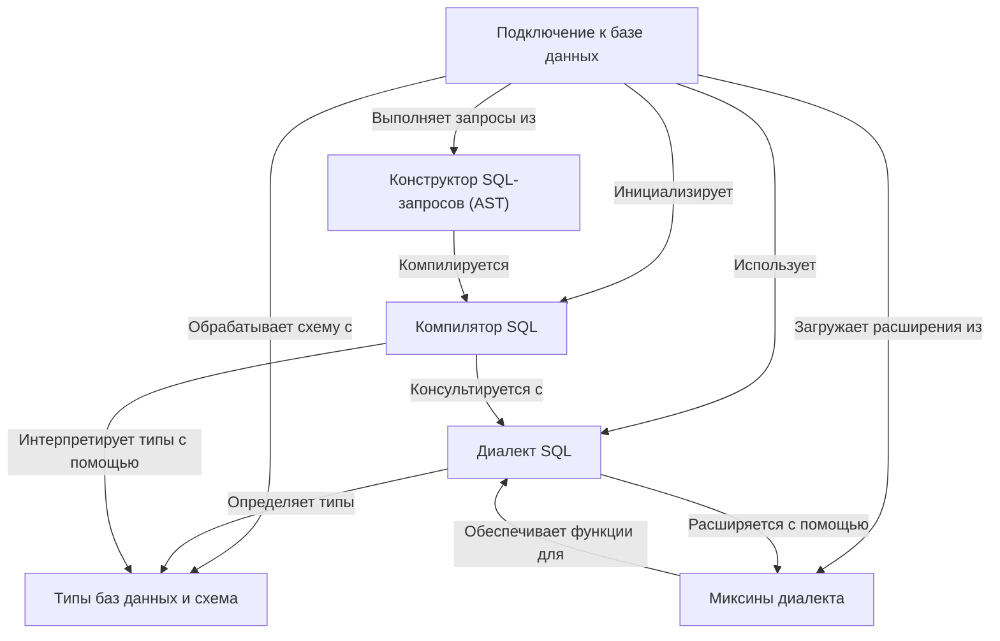

# Учебник: sqeleton

Sqeleton — это библиотека Python, предназначенная для упрощения взаимодействия с различными SQL-базами данных. Она обеспечивает **единый интерфейс подключения** для работы с разными системами баз данных, скрывая низкоуровневые детали. Разработчики могут программировать сложные SQL-запросы с помощью **структурированного конструктора запросов**, который затем автоматически преобразуется в правильный синтаксис SQL для используемой базы данных, обеспечивая *генерацию запросов, независимую от базы данных*.

## Визуальный обзор

## Разделы

1. [Подключение к базе данных
](01_database_connection_.md)
2. [Конструктор SQL-запросов (AST)
](02_sql_query_builder__ast__.md)
3. [Диалект SQL
](03_sql_dialect_.md)
4. [Типы баз данных и схема
](04_database_types_and_schema_.md)
5. [Компилятор SQL
](05_sql_compiler_.md)
6. [Миксины диалекта
](06_dialect_mixins_.md)
