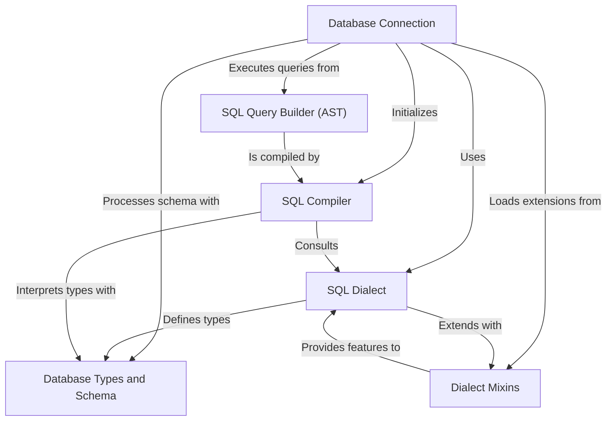

# Tutorial: sqeleton

Sqeleton is a Python library designed to simplify interaction with various SQL databases. It provides a **unified connection interface** to talk to different database systems, abstracting away low-level details. Developers can build complex SQL queries programmatically using a **structured query builder**, which then gets automatically translated into the correct SQL syntax for the specific database being used, ensuring *database-agnostic query generation*.

## Visual Overview

## Chapters

1. [Database Connection
](01_database_connection_.md)
2. [SQL Query Builder (AST)
](02_sql_query_builder__ast__.md)
3. [SQL Dialect
](03_sql_dialect_.md)
4. [Database Types and Schema
](04_database_types_and_schema_.md)
5. [SQL Compiler
](05_sql_compiler_.md)
6. [Dialect Mixins
](06_dialect_mixins_.md)
